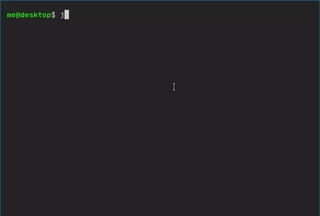

json-tui
========



Features
--------
- **Interactive**: Use keyboard or mouse to scroll/expand objects.
- **Colors**
- **Responsive**: Adapt to the terminal dimensions. Very long text values are
  wrapped on several lines.
- **Cross-platform**: Windows, Linux, MacOS.
- **Small**: ~0.7MB all included. Zero dependencies.
- The output is displayed inline with the previous commands. Meaning you can
  still see the json after leaving json-tui.
- *(Vim users): Also support `j`/`k` for navigation.*
- **Table view**: Turn arrays of objects into tables. <details>
  
  <summary>Video</summary>
  
  

</details>


Features for developers
-----------------------
- **simple**: Only ~400 line of C++ only. Depends on [FTXUI].
- No dependencies to install. Build simply using CMake.

Build:
------
```bash
mkdir build; cd build
cmake ..
make
sudo make install
```

Package
--------

- Binaries: [Available](https://github.com/ArthurSonzogni/json-tui/releases) in release page.
- Deb package: [Available](https://github.com/ArthurSonzogni/json-tui/releases) in release page.
- RPM package: [Available](https://github.com/ArthurSonzogni/json-tui/releases) in release page.
- Arch package: [Available](https://aur.archlinux.org/packages/json-tui-bin/) as AUR package.
- [Snap package](https://snapcraft.io/json-tui): /!\ File access is confined to your home.
```
sudo snap install json-tui
```

Contributors:
--------

Contributor | Work
:---|:--
 [Arthur Sonzogni](https://github.com/ArthurSonzogni) | Author & Maintainer
 [Igor Rudenko](https://github.com/hextriclosan) | Refactoring. Fix buffer size when reading from a file.
 [Corentin Girard](https://github.com/Drarig29) | Arch linux package.
 [Adrià Arrufat](https://github.com/arrufat) | Fix CMake build caused by `GIT_SHALLOW TRUE`
 *You?* | (PR are welcomed)
 

<a href="https://github.com/ArthurSonzogni/json-tui/graphs/contributors">
  
</a>

Similar projects:
----------------
- https://github.com/antonmedv/fx
- https://github.com/skanehira/tson
- https://github.com/cielong/pyfx

[FTXUI]:https://github.com/ArthurSonzogni/FTXUI
